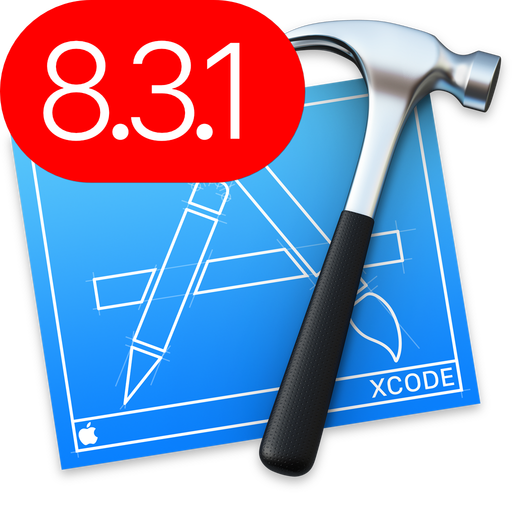
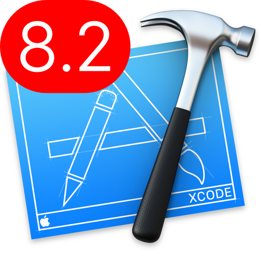
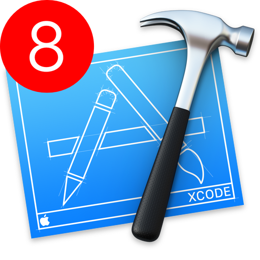
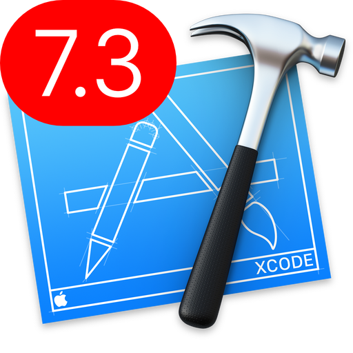
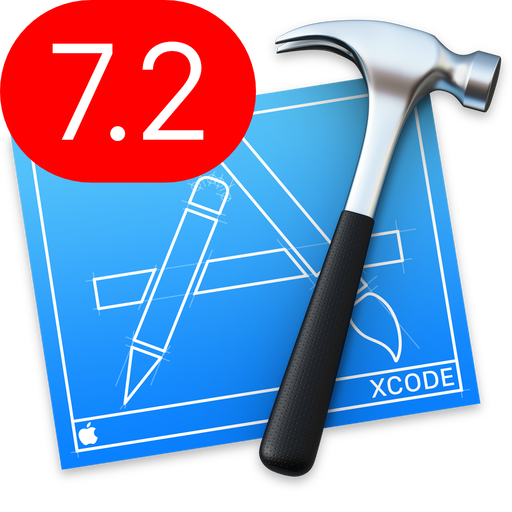
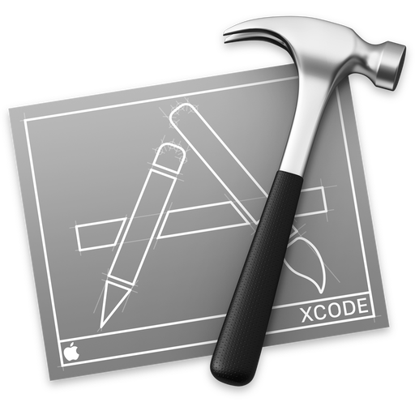

# Xcode icons

---

## Assets
With this repo you could find your way to differentiate your **Xcode** version on your mac. There are several icons to enjoy from `7.2` to `8.3.2`. 

## Usage

## Assets

| Xcode version |    Icon    |        download `.hqx`         |        download `.ico`         |        download `.png` (512x512)      |
|:-------------:|:----------:|:---------------------------------:|:---------------------------------:|:----------------------------------------:|
|`8.3.2`|  | `.hqx` [file](generated-icons/Xcode_8.3.2/Xcode_8.3.2.hqx) |`.ico` [file](generated-icons/Xcode_8.3.2/Assets/Xcode_8.3.2.ico) |`.png` [file](generated-icons/Xcode_8.3.2/Assets/512x512.png) |
|`8.3.1`|  | `.hqx` [file](generated-icons/Xcode_8.3.1/Xcode_8.3.1.hqx) |`.ico` [file](generated-icons/Xcode_8.3.1/Assets/Xcode_8.3.1.ico) |`.png` [file](generated-icons/Xcode_8.3.1/Assets/512x512.png) |
|`8.2.1`|  | `.hqx` [file](generated-icons/Xcode_8.2.1/Xcode_8.2.1.hqx) |`.ico` [file](generated-icons/Xcode_8.2.1/Assets/Xcode_8.2.1.ico) |`.png` [file](generated-icons/Xcode_8.2.1/Assets/512x512.png) |
|`8.2`  |      | `.hqx` [file](generated-icons/Xcode_8.2/Xcode_8.2.hqx)     |`.ico` [file](generated-icons/Xcode_8.2/Assets/Xcode_8.2.ico) |`.png` [file](generated-icons/Xcode_8.2/Assets/512x512.png) |
|`8`    |          | `.hqx` [file](generated-icons/Xcode_8/Xcode_8.hqx)         |`.ico` [file](generated-icons/Xcode_8/Assets/Xcode_8.ico) |`.png` [file](generated-icons/Xcode_8/Assets/512x512.png) |
|`7.3`    |          | `.hqx` [file](generated-icons/Xcode_7.3/Xcode_7.3.hqx)         |`.ico` [file](generated-icons/Xcode_7.3/Assets/Xcode_7.3.ico) |`.png` [file](generated-icons/Xcode_7.3/Assets/512x512.png) |
|`7.2`    |          | `.hqx` [file](generated-icons/Xcode_7.2/Xcode_7.2.hqx)         |`.ico` [file](generated-icons/Xcode_7.2/Assets/Xcode_7.2.ico) |`.png` [file](generated-icons/Xcode_7.2/Assets/512x512.png) |
|gray    |          | `.hqx` [file](generated-icons/Xcode_gray/Xcode_gray.hqx)         |`.ico` [file](generated-icons/Xcode_gray/Xcode_gray.ico) |[`.png` [file](generated-icons/Xcode_gray/Assets/512x512.png) |

## Links

Use this [converter](https://iconverticons.com/online/) to convert `.png` to `.hqx`. You can convert also to .ico or generate Assets of your icons with this converter. 

## License