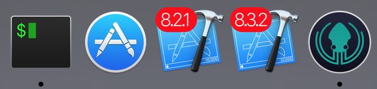
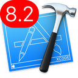
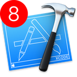
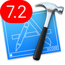
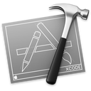

# Xcode icons

---

## Description
With this repo you could find your way to differentiate your **Xcode** version on your mac. There are several icons to enjoy from `7.2` to `8.3.2`. 

## Usage
You need to choose an icon. For example you want to customize **Xcode 8.3.2** icon. Download `generated-icons/Xcode_8.3.2/Xcode_8.3.2` file. Don't mind about why there is no extension (it's a binary version of the icon) or why there is text inside, trust me it's the right file 🤓.

#### Step 1: Copy the icon to the clipboard
- Right click on **icon** file from the **Finder**.
- Choose **Get Info** from the **File** menu.
- In the info window that pops up, **click on the icon**. At the top left hand corner.
- Choose **Copy** from the **Edit** menu.

#### Step 2: Paste the icon to the desired item
- Go to the **Xcode application** in the **Finder** that you want a custom icon.
- Right click on it.
- Choose **Get Info** from the **File** menu.
- In the info window that pops up, **click on the icon**. At the top left hand corner.
- Choose **Paste** from the **Edit** menu.

#### Step 3: Enjoy your newly customized icon!

## Assets
You have several assets to satisfy your needs. If you want more, create an issue, I will create it for you 😜 !

| Xcode version |    Icon    |        download icon         |        download `.ico`         |        download `.png` (512x512)      |
|:-------------:|:----------:|:---------------------------------:|:---------------------------------:|:----------------------------------------:|
|`8.3.2`|  |  [file](generated-icons/Xcode_8.3.2/Xcode_8.3.2) |`.ico` [file](generated-icons/Xcode_8.3.2/Assets/Xcode_8.3.2.ico) |`.png` [file](generated-icons/Xcode_8.3.2/Assets/512x512.png) |
|`8.3.1`|  | [file](generated-icons/Xcode_8.3.1/Xcode_8.3.1) |`.ico` [file](generated-icons/Xcode_8.3.1/Assets/Xcode_8.3.1.ico) |`.png` [file](generated-icons/Xcode_8.3.1/Assets/512x512.png) |
|`8.2.1`|  | [file](generated-icons/Xcode_8.2.1/Xcode_8.2.1) |`.ico` [file](generated-icons/Xcode_8.2.1/Assets/Xcode_8.2.1.ico) |`.png` [file](generated-icons/Xcode_8.2.1/Assets/512x512.png) |
|`8.2`  |      | [file](generated-icons/Xcode_8.2/Xcode_8.2)     |`.ico` [file](generated-icons/Xcode_8.2/Assets/Xcode_8.2.ico) |`.png` [file](generated-icons/Xcode_8.2/Assets/512x512.png) |
|`8`    |          | [file](generated-icons/Xcode_8/Xcode_8)         |`.ico` [file](generated-icons/Xcode_8/Assets/Xcode_8.ico) |`.png` [file](generated-icons/Xcode_8/Assets/512x512.png) |
|`7.3`    |          |  [file](generated-icons/Xcode_7.3/Xcode_7.3)         |`.ico` [file](generated-icons/Xcode_7.3/Assets/Xcode_7.3.ico) |`.png` [file](generated-icons/Xcode_7.3/Assets/512x512.png) |
|`7.2`    |          |  [file](generated-icons/Xcode_7.2/Xcode_7.2)         |`.ico` [file](generated-icons/Xcode_7.2/Assets/Xcode_7.2.ico) |`.png` [file](generated-icons/Xcode_7.2/Assets/512x512.png) |
|gray    |          |  [file](generated-icons/Xcode_gray/Xcode_gray)         |`.ico` [file](generated-icons/Xcode_gray/AssetsXcode_gray.ico) |`.png` [file](generated-icons/Xcode_gray/Assets/512x512.png) |

## Links
If you want to create an icon like me and fork to submit a Pull Request you need :

- A Design application (**Paint** can be your friend 😎). I use [Affinity Designer](https://affinity.serif.com/en-us/designer/). 
- I recommand to you this [converter](https://iconverticons.com/online/) to convert `.png` to `.hqx` (compress format to store binary versions of images, documents, and multimedia files). You can convert also to `.ico` or generate Assets of your icons.
