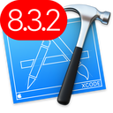
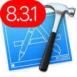
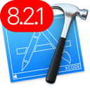
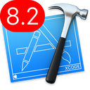
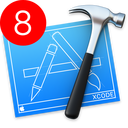

#Xcode icons
---

With this repo you could find your way to differentiate you **Xcode** version on your mac. There are several icons to enjoy. from `7.2` to `8.3.2`. 

##Xcode 8.3.2. You can download icon [here](generated-icons/Xcode_8.3.2/Xcode_8.3.2).

##Xcode 8.3.1. You can download icon [here](generated-icons/Xcode_8.3.1/Xcode_8.3.1).

##Xcode 8.2.1. You can download icon [here](generated-icons/Xcode_8.2.1/Xcode_8.2.1).

##Xcode 8.2.1. You can download icon [here](generated-icons/Xcode_8.2/Xcode_8.2).

##Xcode 8. You can download icon [here](generated-icons/Xcode_8/Xcode_8).

use this [link](https://iconverticons.com/online/) to convert `.png` to `.hqx`

